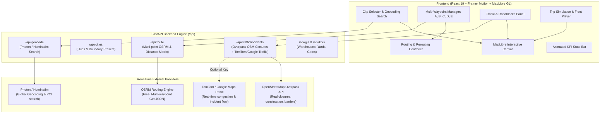

# Implementation Plan: Phase 1 Digital Twin Foundation with Framer UI, Multi-City Selection, Multi-Stop Routing & Real-Time Traffic/Roadblocks

LogiSync is an AI logistics digital twin. As requested, we assume a fresh start and implement each phase sequentially per the `README.md` roadmap, starting with a state-of-the-art **Framer-grade modern frontend**, **dynamic city selection**, **multi-point route planning (A, B, C, D, E waypoints)**, and **real-time traffic and roadblock detection APIs**.

---

## Architecture & API Strategy



### 1. Dynamic City Selection
- Supports pre-configured logistics hubs:
  - **Thoothukudi MMLP / VOC Port** (Tamil Nadu)
  - **Chennai Port & Sriperumbudur MMLP** (Tamil Nadu)
  - **JNPT / Navi Mumbai Logistics Hub** (Maharashtra)
  - **Bengaluru ICD Whitefield & Logistics Park** (Karnataka)
  - **Delhi NCR Multimodal Logistics Hub / Dadri** (Greater Noida / NCR)
  - **Mundra Port & SEZ** (Gujarat)
- **Live Search Any City**: Built-in instant geocoder (using Photon / Nominatim API via backend proxy) so users can type and fly to *any* city globally with automatic bounding box adjustment.

### 2. Multi-Point Source & Destination (A, B, C, D, E Points)
- Dynamic Waypoint List:
  - Add origin (Point A), intermediate transfer points/cross-docks (B, C, D), and final destination (Point E).
  - Add, remove, re-order waypoints with Framer Motion drag-or-button animations.
  - **Two input modes**:
    1. Search address / landmark / terminal inside the active city.
    2. Interactive "Drop Pin" mode directly on the map.
  - Interactive map markers: Distinct Framer-styled glowing letter badges (`A`, `B`, `C`, `D`, `E`) with pulse rings.

### 3. Real-Time Traffic & Roadblocks Engine
- **Multi-stop Routing**: Queries OSRM `/route/v1/driving/{coords}` with full turn-by-turn steps, durations, and distances across all waypoints.
- **Real-Time Roadblocks & Incidents**:
  - Pulls real-time road closures, construction zones (`highway=construction`), access blocks (`barrier=*`, `access=no`), and hazard nodes using OpenStreetMap Overpass queries.
  - Supports optional **TomTom Traffic Flow & Incidents API** or **Google Maps API** via environment variables / UI settings.
  - Color-coded route segments:
    - 🟢 Green / Cyan: Free flow (normal speed)
    - 🟡 Yellow: Moderate delay
    - 🔴 Red: Heavy congestion
    - ⛔ Glowing Red Dashed / Hazard Cones: Blocked road / Construction barrier.
  - **Smart Detour / Reroute**: Single-click button to recalculate route avoiding detected roadblocks.

### 4. Framer-Grade Modern Frontend Design
- Sleek dark glassmorphic control dock (backdrop blur, slate-900/950 palette, emerald & cyan neon accents).
- Collapsible Framer-animated drawers for:
  - Route & Waypoint Builder (A, B, C, D, E)
  - Live Traffic & Roadblock incident stream
  - KPI & Telemetry overview (Distance, Duration with traffic delay, Fuel/CO2, Active Roadblocks)
  - Interactive Trip Playback scrubber (animates a vehicle traversing along the multi-point path with play/pause/speed controls).

---

## Proposed Changes

### Dependencies & Setup

#### [MODIFY] [frontend/package.json](file:///e:/project/LogiSync/frontend/package.json)
- Add `framer-motion` (v12 / latest compatible with React 19)
- Add `lucide-react` (icons for navigation, waypoints, road blocks, city search, car/truck simulation)
- Add `clsx` and `tailwind-merge` for clean dynamic styling

#### [MODIFY] [backend/requirements.txt](file:///e:/project/LogiSync/backend/requirements.txt)
- Ensure `httpx`, `fastapi`, `uvicorn`, `pydantic` are up to date for async external API calls (OSRM, Overpass, Geocoding).

---

### Backend API Services

#### [NEW] [backend/app/routers/routing.py](file:///e:/project/LogiSync/backend/app/routers/routing.py)
- `/api/cities`: List available city presets with center coords, zoom, and logistics points of interest.
- `/api/geocode`: Fast search endpoint proxying Photon/Nominatim for cities, roads, and logistics facilities.
- `/api/route`: Accepts list of coordinates `[[lon, lat], ...]`, calls OSRM to generate the multi-leg route GeoJSON, leg distances, durations, and instructions.
- `/api/traffic/incidents`: Fetches and caches roadblocks, construction zones, and traffic incidents for the selected city bounding box (via Overpass + TomTom fallback).
- `/api/traffic/reroute`: Rerouting endpoint calculating avoidance waypoints around detected roadblocks.

#### [MODIFY] [backend/app/main.py](file:///e:/project/LogiSync/backend/app/main.py)
- Register `routing.py` router with FastAPI app.
- Enable CORS for development frontend.

---

### Frontend Components (Framer Motion UI)

#### [NEW] [frontend/src/types/logistics.ts](file:///e:/project/LogiSync/frontend/src/types/logistics.ts)
- TypeScript interfaces for `City`, `Waypoint`, `RouteResult`, `TrafficIncident`, `SimulationState`.

#### [NEW] [frontend/src/services/api.ts](file:///e:/project/LogiSync/frontend/src/services/api.ts)
- API client functions for city geocoding, multi-point routing, and real-time traffic/incidents.

#### [NEW] [frontend/src/components/CitySelector.tsx](file:///e:/project/LogiSync/frontend/src/components/CitySelector.tsx)
- Framer-animated dropdown with quick city chips and search input for any global city.

#### [NEW] [frontend/src/components/WaypointManager.tsx](file:///e:/project/LogiSync/frontend/src/components/WaypointManager.tsx)
- Reorderable multi-point planner (Origin A -> Stop B -> Stop C -> Stop D -> Destination E).
- Search input per stop or "Pick on Map" button.
- Add stop / Remove stop buttons with smooth entry/exit animations.

#### [NEW] [frontend/src/components/TrafficRoadblocksPanel.tsx](file:///e:/project/LogiSync/frontend/src/components/TrafficRoadblocksPanel.tsx)
- Traffic toggle (Flow, Incidents, Roadblocks).
- List of detected roadblocks on or near the route.
- "Auto Detour" action button to bypass roadblocks.

#### [NEW] [frontend/src/components/TripSimulator.tsx](file:///e:/project/LogiSync/frontend/src/components/TripSimulator.tsx)
- Framer Motion floating bottom scrubber.
- Play / pause / speed controls (1x, 2x, 5x).
- Visual truck progress marker traveling between waypoints on the map.

#### [NEW] [frontend/src/components/KPIStatsHeader.tsx](file:///e:/project/LogiSync/frontend/src/components/KPIStatsHeader.tsx)
- Animated counters for Trip Distance, Total ETA, Traffic Delays, Roadblocks Avoided, Fleet Status.

#### [MODIFY] [frontend/src/App.tsx](file:///e:/project/LogiSync/frontend/src/App.tsx)
- Integrate MapLibre GL with dynamic city camera fly-to animations.
- Multi-colored route rendering with traffic flow gradients.
- Interactive custom DOM markers for A, B, C, D, E waypoints and Roadblock hazard cones.
- Layout orchestration with Framer Motion sidebars and docks.

#### [MODIFY] [frontend/src/index.css](file:///e:/project/LogiSync/frontend/src/index.css)
- Custom glow styles, pulse animations, map marker styling, modern scrollbars.

---

## Verification Plan

### Automated Tests
- Test backend endpoints using `pytest` or `httpx`:
  ```powershell
  cd backend
  python -m pytest
  ```
  - Verify `/api/cities` returns preset cities.
  - Verify `/api/route` returns GeoJSON LineString for multi-waypoint input.
  - Verify `/api/traffic/incidents` returns feature collection with incidents.

### Frontend Verification
- Run `npm run build` in `frontend` to verify TypeScript compile and Vite bundle integrity.
- Start dev server with `npm run dev` and test:
  1. Dynamic City Selection: Switch between Thoothukudi, Chennai, Mumbai, or type custom city; verify map smoothly flies to location.
  2. Multi-point routing: Add points A, B, C, D, E via map click and search; verify polyline connects all stops with distance/ETA.
  3. Real-time traffic & roadblocks: Toggle traffic layer; verify roadblock markers and detour recalculation.
  4. Simulation playback: Press play on the simulator dock and verify truck animates smoothly along the path.
